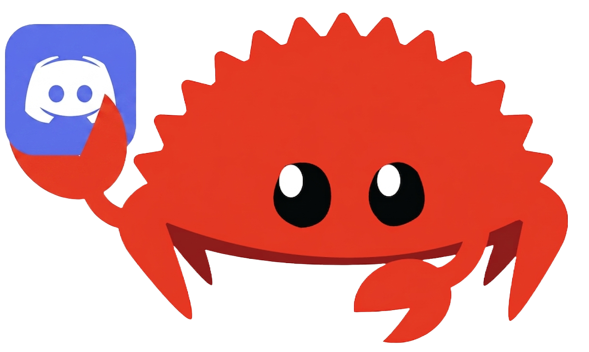

<div align=center>
    

<h3>Disaity</h3>

<p>
    A Rust framework for building Discord music and chat bots, on top of
    <a href="https://github.com/serenity-rs/serenity" target="_blank">serenity</a>,
    <a href="https://github.com/serenity-rs/poise" target="_blank">poise</a> and
    <a href="https://github.com/serenity-rs/songbird" target="_blank">songbird</a>.
</p>

</div>

<div align="center">

[](https://github.com/AhmedEhab-SG/disaity/actions/workflows/ci.yml)
[](https://crates.io/crates/disaity)
[](https://docs.rs/disaity)
[](https://www.rust-lang.org)

</div>

<br/>

Disaity builds Discord bots that play music in voice channels, pre build features,
subscrible to events and send you back in character.

## Getting started

```bash
cargo new bot && cd bot
cargo add disaity tokio -F tokio/macros,tokio/rt-multi-thread
```

Create a `.env` file at the root for your project or add it in your system,
You can use the default key names or custom,
then run `cargo run -- --install bin` once to fetch external binaries
if the required bin not found on the system or insallted on bin directory
the bot will panic,
refer to [binaries](https://github.com/AhmedEhab-SG/disaity/tree/main/BINARIES.md)
for more info, then `cargo run`.

Some features requires additional enviroment key;

- `chat` features uses gemini ai models needs an api secret.
- `subscription` features uses SQLite just need a path folder.

refer to [.env.example](https://github.com/AhmedEhab-SG/disaity/tree/main/.env.example)
to follow the default env key, you can still pass you custom key while building
the client instead of the default keys.

## Example

Basic music bot looks like:

```rust
use disaity::prelude::*;

#[tokio::main]
async fn main() -> Result<(), Error> {
    Binaries::ensure().await?;

    let data = DataBuilder::new()
        .with_config(
            ConfigBuilder::new()
                .with_info(Info::new().with_prefix("!"))
                .with_persona(Persona::new(Preset::Emilia))
                .build(),
        )
        .build()
        .await?;

    Client::new()
        .with_feature(Commands::music())
        .with_feature(Commands::other())
        .with_data(data)
        .run()
        .await
}
```

Or test [example](crates/disaity/examples/basic.rs)

```bash
git clone https://github.com/AhmedEhab-SG/disaity
cd disaity
cp .env.example .env    # then fill in CLIENT_TOKEN

cargo run --example basic -- --install bin    # fills bin/, no token needed
cargo run --example basic
```

View [full examples](crates/disaity/examples)
on how to setup and use disiaty with its builtin features to make you custom charature bot.

> [!NOTE]
> Make sure to add to ensure the bin are loaded or it will fail on runetime
> when trying to use the target binaray.
>
> ```rust
> Binaries::ensure().await?; // looks in this order to find the bin
> ```

## Features

**Playing music from any provider.** Playback goes through `yt-dlp` and
FFmpeg, so YouTube, SoundCloud and Spotify and fallback to `yt-dlp` if the
target provider not found. Playlist are being scraped to work without
registering.

**Has it's own personality.** Personas are TOML — a system prompt for the AI
and Two ship with the crate (`Preset::Emilia`, `Preset::Rem`);
point `Persona::from_file_over` at your own file to override
any part of one and keep the rest.

**Chat, if you want it.** The `ask` command talks to Gemini using the persona's
system prompt as its character brief. It needs `GEMINI_API_KEY` — register
`Commands::chat()` without one and the client stops at startup and tells you
so, rather than failing later on someone's first question. Drop that one line
and the rest of the bot runs fine without a key.

**Subscriptions moudle.** is a pair of commands — subscribe and unsubscribe
on an event which run in the back ground. It needs `DB_PATH` to save the tasks
and then posts them on schedule. Modules persist their subscriptions. They
Implement `SubscriptionModule` so you can write your own.

## Building it

You need the Rust toolchain — `rustup` is the easy way:

```bash
curl --proto '=https' --tlsv1.2 -sSf https://sh.rustup.rs | sh
```

Songbird's audio stack also wants `cmake` and a C compiler on the box.
