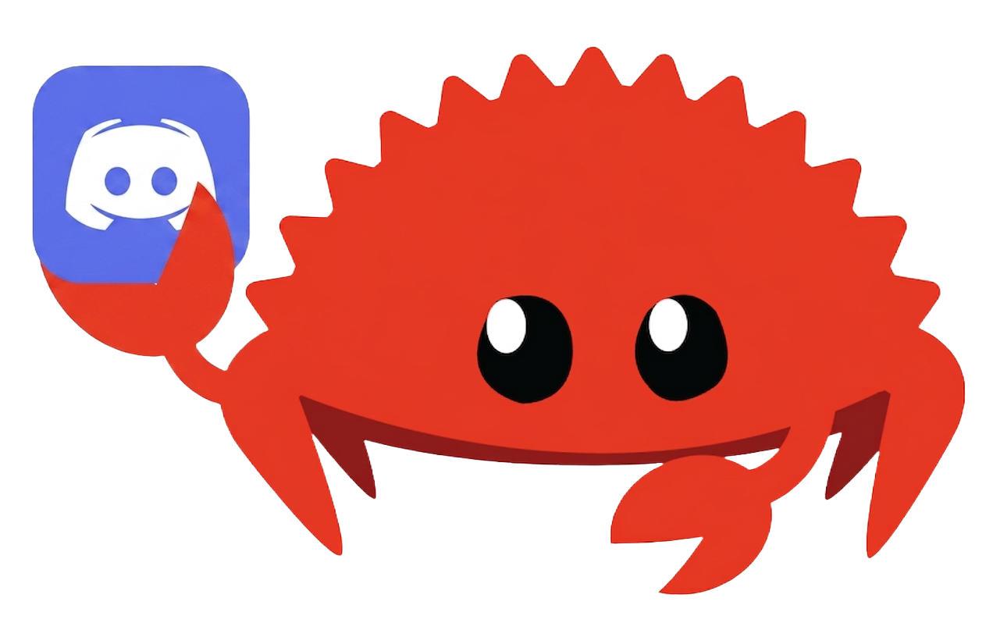

<div align=center>
    
 
<h3>Disaity</h3>

<p>
    A Discord bot using
    <a href="https://github.com/serenity-rs/serenity" target="_blank">serenity</a> to play music and chat with.
</p>

</div>

<div align="center">

[](https://github.com/AhmedEhab-SG/disaity/actions/workflows/release.yml)
[](https://github.com/AhmedEhab-SG/disaity/releases/latest)
[](https://www.rust-lang.org)

</div

<br/>

## 📝 Description

> Disaity is a Discord bot built in Rust with zero external dependencies. It combines a low-latency music streaming experience with a AI chat interface.

## 🛠️ Core Technologies

- [`Serenity`](https://github.com/serenity-rs/serenity): A Rust library for the Discord API.
- [`Poise`](https://github.com/serenity-rs/poise): An advanced command framework providing seamless Slash Command and Prefix command support.
- [`Songbird`](https://github.com/serenity-rs/songbird): A professional-grade audio library for high-fidelity voice chat interactions.
- [`Gemini-Rust`](https://github.com/flachesis/gemini-rust/): A comprehensive Rust client library for Google's Gemini API.
- [`Scraper`](https://github.com/rust-scraper/scraper): HTML parsing and querying with CSS selectors to extract playlist names.
- [`YT-DLP`](https://github.com/yt-dlp/yt-dlp): A feature-rich command-line audio/video downloader
- [`FFmpeg`](https://ffmpeg.org/): A complete, cross-platform solution to record, convert and stream audio and video.

## ✨ Key Features

- **Crystal Clear Audio:** High-performance music playback with support for queues, skipping, and volume control using Songbird's voice engine.
- **Cross Music Provider:** Using yt-dlp and FFmpeg enables downloading and converting music from YouTube, SoundCloud, and Spotify without external APIs by leveraging direct web parsing.
- **AI Conversations:** Chat with an character persona. Ask questions or just vibe with a bot that actually remembers context.
- **Slash Command Native:** Fully optimized for Discord's modern UI using poise.

## 📥 Installation (For Developers)

#### 📦 Large File Handling (Git LFS)

This repository uses Git LFS to manage the large binary engines required for audio processing. Before cloning, ensure you have Git LFS installed on your system.

```bash
# Install Git LFS
git lfs install

# Clone the repository (this will automatically pull the binaries)
git clone https://github.com/AhmedEhab-SG/disaity

# pull the bin/ pointer
git lfs pull
```

> [!IMPORTANT]
> If you don't use **Git LFS**, the files in `bin/` will be empty pointers.
> You will need to manually download [FFmpeg](https://ffmpeg.org/download.html)
> and [yt-dlp](https://github.com/yt-dlp/yt-dlp#installation) for your system and replace the empty pointers with your downloaded binaires.

#### 🦀 Prerequisites

The project is built with purely Rust, you must have the Rust toolchain installed. The recommended way is via `rustup`:

```bash
# Install Rust (curl)
curl --proto '=https' --tlsv1.2 -sSf https://sh.rustup.rs | sh
```

#### ⚙️ Setup Environment Variables

```bash
# Clone the repo
git clone https://github.com/AhmedEhab-SG/disaity

# Open its folder disaity
cd disaity

# create your environment variables
echo "DISCORD_TOKEN=your_token" > .env
echo "GEMINI_API_KEY=your_key" >> .env

# Build and run
cargo run --release
```

## 🏷️ Releases & User Setup

If you don't want to build the bot from source, you can use the pre-compiled binaries from the Releases page.

#### 💿 Download

1. Go to the latest [**release**](https://github.com/AhmedEhab-SG/disaity/releases) and **download** the .zip or .tar.gz for your Operating System.

2. **Extract** the folder to your preferred location.

#### ⚙️ Configure Environment

The bot requires API keys to function. We have provided a template file to make this easy.

1. **Find** the file named .env.example in the root folder.

2. **Rename** it to simply .env.

3. **Open** .env with a text editor and fill in your credentials:

```bash
DISCORD_TOKEN=your_discord_bot_token_here
GEMINI_API_KEY=your_google_gemini_api_key_here
```

#### 🚀 Step 3: Launch

1. **Windows:** Double-click disaity.exe.

2. **Linux:** Open your terminal in the folder and run:

```bash
chmod +x disaity
./disaity
```
